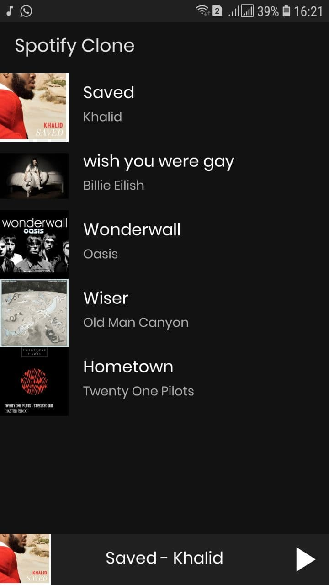
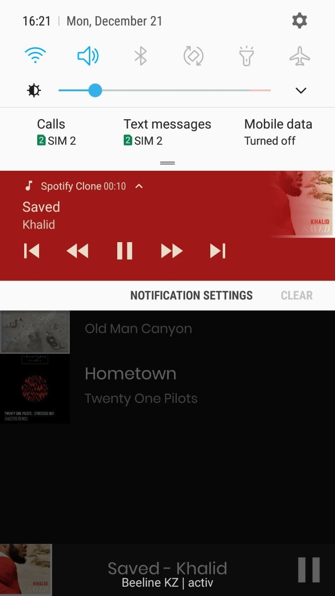
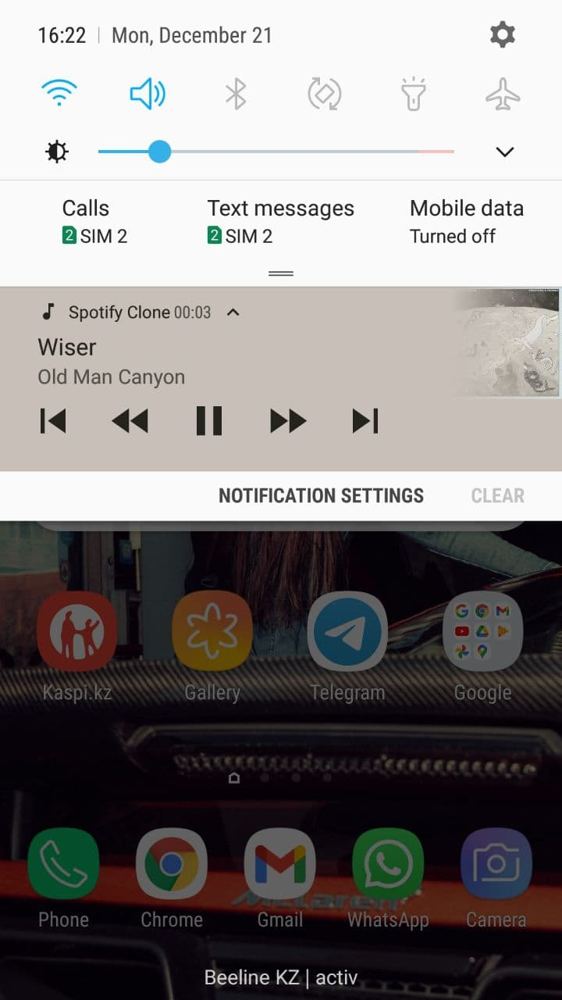
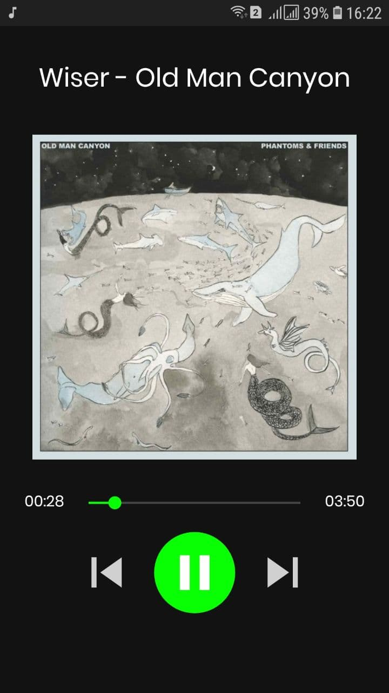
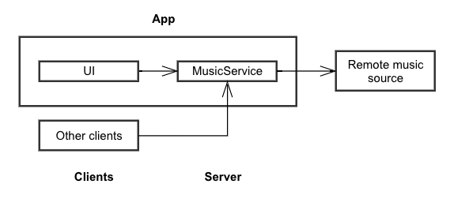
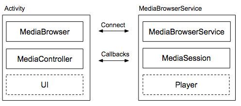
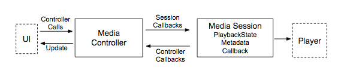
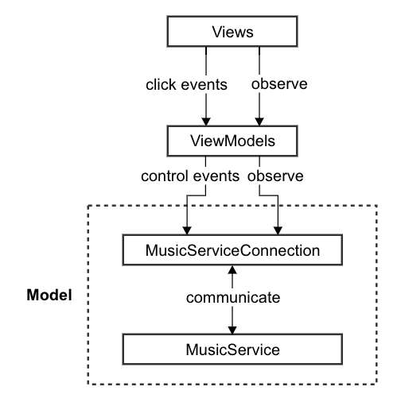

# SpotifyClone
Spotify Clone is music player app for Android written in Kotlin. It supports many features including background playback, audio focus handling, multiple platforms (like Wear, TV and Auto).
It loads a music catalog from a remote server [Firebase Firestore][0] and allows the user to browse the albums and songs. All music and images are stored in [Firebase Storage][2].
A notification allows users to see the song being played and to control playback. It's also a mandatory requirement for a foreground service and stops MusicService from being killed. Audio playback is provided by [ExoPlayer][3].

## Architecture overview
Spotify Clone follows the client/server architecture as described in the ["how to build an audio app"][1] official documentation.
Here's an architectural overview:

The client is an Activity in your app that includes a MediaBrowser, media controller, and the UI. The server is a MediaBrowserService containing the player and a media session.

By keeping the objects responsible for audio playback inside a service it allows audio to be played in the background, decoupling playback from the app's UI.
If the user switches to another app, the service can run in the background. By factoring the two parts of an audio app into separate components, each can run more efficiently on its own. A UI is usually short-lived compared to a player, which may run for a long time without a UI.

## Media session and controller
A MediaSession represents an ongoing media playback session. It provides various mechanisms for controlling playback, receiving status updates and retrieving metadata about the current media.

A MediaController is used to communicate with the media session. It receives media button events and forwards them to the media session. State and metadata updates from the media session are performed through a MediaController.Callback.

# UI
The user interface allows users to:
* browse and play songs
* play and pause songs
* see changes in the underlying player, such as playback duration
* view metadata about the currently playing song including album art, title and artist

Spotify clone achieves this by using a Model-View-ViewModel architecture. This allows a separation of responsibilities between each layer.

[0]: https://firebase.google.com/docs/firestore
[1]: https://developer.android.com/guide/topics/media-apps/audio-app/building-an-audio-app
[2]: https://firebase.google.com/docs/storage
[3]: https://developer.android.com/guide/topics/media/exoplayer
